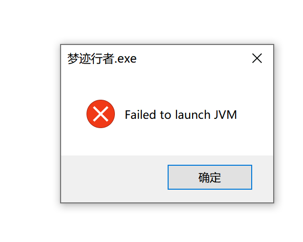

# CaveDream 游戏设计文档 (GDD)

> 版本 **v0.47** · 主题：梦境 · 类型：2D 沙盒冒险 + RPG（类泰拉瑞亚）· 中文名：**梦迹行者**
> 原则：先定骨架、逐版填充；手工内容管"深度与意义"，程序生成管"广度与无限"。
> 空间哲学：**无限的是梦，有限的是每个梦**——层数无限（梦海），每层有限（箱庭）。
> 本文档为活文档（living document），随开发持续修订。

---

## 0. 高概念 (High Concept)

- 一句话：一个沉睡者在多层梦境中不断"下潜"，最终直面自我心魔；通关后坠入无尽的"元梦之海 (Eternal)"，自由探索永无终局。
- 三大支柱：
  1. **梦境即玩法**：每一层梦都会改写世界法则（重力、时间、生成规则），"梦"不是皮肤而是机制。
  2. **有序叙事 + 无限沙盒**：主线（下潜）赋予意义，Eternal 之后的梦海赋予无尽耐玩度。
  3. **可插拔扩展**：新增一条法则 / 一个 Boss / 一种生态，即自动扩充主线与梦海的内容池，更新成本极低。

---

## 1. 世界观与叙事

- 主角：现实中沉睡 / 昏迷的做梦者，意识在梦境体系中不断下潜。
- 核心命题："梦的尽头不是醒来，而是承认自己。"
- 叙事弧线：逐层下潜 → 越深层越接近"真实的自我" → 终层 E 遭遇被压抑的 **自我心魔 (Inner Shadow)** → 击败并接纳后梦境"破碎" → 坠入 **元梦之海 (Eternal)**。
- 情感基调：浅层奇幻怀旧；中层荒诞不安；Eternal 超现实、自由、孤独。

---

## 2. 梦境层级结构（《盗梦空间》式下潜）

> 主线：有序、手工配置、每层一个 Boss 闸门；通关后：无序、程序生成。

### 2.1 主线层（Storyline，有序下潜）

| 层 | 代号 | 主题 | 该层引入的梦境法则 | 守层 Boss |
|----|------|------|--------------------|-----------|
| L1 | 浅梦 | 童年 / 日常记忆 | 基础：挖掘 / 建造 / 昼夜 | 游荡者（教学 Boss） |
| L2 | 迷梦 | 迷失 / 空间扭曲 | 地图不稳定、通道会重排 | 迷宫守望者 |
| L3 | 坠梦 | 失重 / 倒悬 | 重力可翻转 | 坠落之影 |
| L4 | 魇梦 | 恐惧具象化 | 随机"魇潮"侵蚀安全区 | 心魔前影 |
| L5 | **E (Eternal)** | 自我本源 | 前述法则融合 + 扭曲 | **自我心魔 Inner Shadow**（主线终 Boss） |

- 下潜条件：击败本层 Boss → 解锁通往下一层的"入梦锚"。
- 每层是一个独立维度（`dimensionId`），但共享同一套系统。
- E 的双重含义：既是主线终点 "Eternal"，也是无尽冒险的起点。

**层生成方式（v0.26 定稿 · 方案 C：种子生成 + 手工骨架）**

> 骨架固定（设计器写死），血肉种子化（人人不同）——泰拉瑞亚同款路线，"每个世界都独特"实为"骨架永远可靠，血肉永远新鲜"。

- **骨架（不变量）**：四带一海划分与尺寸（§2.3）、入梦锚=天空带、Boss 门=地狱带（位置锁中央还是种子化待定）、织梦台/梦之工匠/分支节点/叙事点位/海（≥1 侧）等关键设施必生成清单；
- **血肉（种子化）**：地形轮廓、洞穴路径、矿脉/植被/资源分布、遗迹装饰、宝藏与瓶罐具体位置；
- **种子派生**：`layerSeed = hash(存档种子, layerId)`——玩家只持有一个种子，五层各自确定可复现；
- **硬保证校验**（不满足则重滚）：出生点→Boss 门存在可通行路径（洪水填充）；Boss 竞技场强制净空；工匠 NPC 落点必有平地；
- **版本盐**：生成参数绑定 `gameVersion`，老存档永不因更新变形（与云存档 game_version 呼应）；
- **彩蛋**：主线层同样可页拓分享（"我的坠梦里有悬空倒塔，种子给你"）；
- **架构同构**：主线层（手工骨架 spec）与梦海层（全随机 spec）共用同一执行器，落在 §2.3 预留的 `LayerLayout` 与未来 `DreamLayerSpec` 上。

### 2.2 元梦之海 (The Dream Sea / Eternal)

- 触发：击败自我心魔后，主线层"破碎"，解锁 Dream Sea。
- 形态：**无限、AI 与程序协同生成**的平行梦境序列，各层记作 **Xᵢ 层**（**彼此平行、无递进关系**，i 仅为编号/收录顺序），通过《回溯之书》的【多元梦境探索】功能进入，**到访过的 Xᵢ 永久收录为书页、可重返**（书页即"随机但持久"的玩家侧载体，见 §4.1）。
- 内容组合公式：可玩层空间 ≈ 法则池 × 生态池 × Boss 池（内容随每次更新指数膨胀）。
- 防疲劳轻骨架：
  - **锚点 (Anchor)**：周期性出现的稳定层，可建造 / 存档 / 休整。
  - **轮回 Boss**：主线 Boss 以"变体形态"重现于梦海（高难 + 稀有掉落），复用素材。
  - **稀有度-潜度曲线**：潜度由玩家探索前自选（见 §4.1），越深的梦法则越扭曲、奖励越稀有，驱动 risk/reward。

### 2.3 层的空间形态：有限箱庭（Sandbox Garden）

> v0.5 拍板，v0.5.1 修正对比对象：每层梦是一张**有限的连通 2D 地图**。
> 注：泰拉瑞亚本身就是有限箱庭——世界尺寸生成时即固定、整层驻内存，边缘以狱海为界；
> "无限 + chunk 流式生成"是 Minecraft 的模型。我们与泰拉瑞亚的差异不在有限/无限，
> 而在结构：它是**一张有限大世界**，我们是**每层一个有限箱庭、层数无限（梦海）**。
> 理由：① 内容密度——梦无废话，每屏都有设计；② "无限"职责已由梦海承担，层内无需无限；
> ③ 2D 四向移动下垂直性即核心体验；④ 技术上整层驻内存（256×192 ≈ 98KB），与泰拉瑞亚同为"全驻留"路线，MVP 无需 Minecraft 式 chunk 流式加载。

**单梦一世界·纵向四带 + 横向一海（v0.27 取代三段式，每层都是完整自足的小世界）：**

```
☁ 天空带   浮岛群 + 入梦锚（主浮岛上）——"坠入梦境"从天落
▓ 地表带   生态、梦之工匠、织梦台、床址预留地、树与遗迹
◘ 洞穴带   洞系、矿脉、宝箱、叙事碎片点、魇潮侵蚀区
♨ 地狱带   层底极热区（梦的残渣"滓"），Boss 门 + 竞技场，下潜入口
≈ 海       左右两侧至少一侧（种子定单/双侧，双侧概率建议 25%）；
           海面接地表带、海沟穿洞穴带、海底触地狱带——海是"横向的第二条垂直轴"
```

**海洋机制（v0.27）**：溺水不致死——水下梦眠消耗按深度渐变 ×2→×5、浮出即恢复（"被憋醒"而非淹死）；每层海底必刷 1 宝箱 + 专属资源**月珠**（附魔"灵"词条材料，海直接喂给品质系统）；海岸有沙滩过渡带。

**带高占比是每层的骨架参数**（地形性格）：L1 教学层压扁四带（天空 15% / 地表 30% / 洞穴 40% / 地狱 15%）；L3 坠梦天空带放大 30%；同骨架不同配比即每层不同世界。

**尺寸标定（v0.30 两档制，本游戏没有小地图）**：

| 档 | 尺寸（tile） | = 几屏 | 谁能用 |
|----|-------------|--------|--------|
| **中世界** | **8400 × 1600** | 105 × 36 屏 | **主线 L1~L5 全部统一用此档**；部分梦海 Xᵢ |
| **大世界** | **10800 × 1800** | 135 × 40 屏 | E 层通关后随梦海解锁；部分梦海 Xᵢ |

- 五层同尺寸后，**地形性格完全由带高配比表达**（同画布不同构图）；E 后解锁大世界本身即奖励演出："你连梦的画布都变大了"；
- Xᵢ 档位抽取（v0.31 定稿）：**潜度 <5 全中世界；≥5 大世界概率随深度爬升；潜度 10+ 必大**——"越深的梦越浩瀚"，尺寸也是潜度奖励曲线的一部分。

预算与连锁义务（v0.30）：最大层 10800×1800 ≈ 1944 万格 × 2B ≈ **39MB/层**，单层驻留成立；配套——① **Chunk（32×32）转正**：数据全驻留，光照/刷怪/资源重生按 chunk 脏矩形更新；② **存档 RLE 行程压缩**（预计 1~3MB/层，云存档可扛）；③ **梦锚柱快速旅行**（见下）；④ 要素规模：分支 10~14、宝箱 8~12、叙事点 10+、海宽 600~1000 列。

**梦锚柱（层内传送，v0.29 提案 / v0.31 准奏）**：每层散布 4~6 根古代梦界碑，探索点亮后可从《回溯之书》本层页传送到任意已亮柱；锚柱周边天然成前哨（搭床建房/探索圈）；柱间距 1500~2000 格 = 几何上强制"每 20 秒路程必有兴趣点"，密度红线从口号变定理。入梦锚=跨层旅行，梦锚柱=层内旅行，同源于"梦标记过的坐标"。

### 2.4 尺度标准（v0.7 拍板，全链路基座）

| 常量 | 值 | 说明 |
|------|----|------|
| 逻辑方块 | **16 × 16 px** | 业界像素沙盒事实标准，匹配 16px 素材生态（Kenney/CC0）；素材包内每个 tile 均按 16px 作画 |
| 基准窗口 | **1280 × 720** | 恰好 80×45 格，1:1 像素完美 |
| 视口规则 | **逻辑高度锁死 45 格（720px），宽度按屏幕比例** | 保证任何分辨率下"竖向看见的空间感"一致（1920×1080 → 90×45 格）；整数缩放优化 M6 前处理 |
| 单屏 | 80 × 45 格 = 1280 × 720 px | 空间感计量单位 |
| 交互射程 | 6 格 | 挖掘/放置 |

**每层"大箱庭"的依据（v0.29 重定标）**：层与层**不是**一张大地图的垂直分带，而是**每个梦境都是一张完整自足的大世界**（泰拉瑞亚中世界级宽度）——自己的天穹、多个地表生物群系、洞系群、海与地狱（§2.3 四带一海在每层内部重演）；层间是**平行世界关系**、靠"下潜"连接。梦无废话原则不变，由要素数量随尺寸放大+梦锚柱间距约束共同保证。

**内存/存档账（v0.29 更新）**：单层最大 ≈ 43MB（short[] 全驻留）；存档 = 整层 RLE 行程压缩（预计 1~3MB）+ 每层 `LayerSnapshot` 改动记录；光照/刷怪/资源按 Chunk 脏矩形更新。

**玩家碰撞盒定稿（v0.17，原待实测项）**：高 **2.6 格** × 宽 **1.3 格**（41.6×20.8 px，类泰拉瑞亚比例）——1 格竖井不可穿过，竖行挖掘需 ≥2 格宽，挖掘行为即泰拉瑞亚手感。**初始跳跃高 4.5 格（v0.46）**；史莱姆跳高 5.5–7 格（随机）。

**纹理升级路线**：M2-a 程序化 16px 图集（噪点+边缘暗化，零素材依赖）→ M2-b Kenney/CC0 包替换 → 中期 Aseprite 自绘。

**物品词典与图片入库管线（v0.39，数据驱动渲染落地）**：

> 一切从"方块是代码里算出来的"升级为"**图片是数据库里存着的**"。渲染不再是硬编码程序生成，而是"物品ID → 形态子表 → 图片 → 画布"。

- **数据模型**：`t_item_def`（物品ID主表）一对多 `t_item_form`（形态子表：`kind`(fill/lip/blob/wave…)、`variant`、`weight`、**`png`(LONGBLOB 图片二进制)**、`px_w/px_h`、`content_sha`）。渲染时按 (邻居, 权重, 内容哈希) 选形作画。
- **存储选型**：PNG 字节存 BLOB + `content_sha` 内容寻址去重；单库即全部资产，`mysqldream` 全量备份。客户端按 `<sha>.png` 落盘缓存，HTTP 强缓存 immutable。
- **美术来源双通道**：① `AssetBaker` 用现有程序化绘制导出占位 PNG → 后端 `ItemSeeder` 启动幂等灌库（不覆盖已有）；② `POST /api/items/{id}/{kind}/{variant}`（X-Token）上传真实手绘 PNG 覆盖同名形态。
- **接口**：`GET /api/items`（元数据+sha，不含字节）、`GET /api/items/image/{sha}`（PNG 字节）。客户端 `ItemCatalog` 异步拉取→建 Texture，**离线/未就绪回退程序生成**（`BlockTextures`）。
- **验收**：当前用 `TestBed` 手搭测试床（一屏铺全材料）核对图片渲染，世界生成器暂不作为主路径（按用户指示"先不生成地图、先把物品搞好"）。

**边界表现**：四周为"梦之雾"软墙（粒子提示"梦在此尽"），无跌落死亡——惩罚只留给死亡机制，避免双重挫败。（同泰拉瑞亚狱海边界的思路，用主题化软墙替代伤害墙）

**资源再生（"梦会重构"）**：地形改动（挖洞/建造）持久保存，保护玩家投入；可采集资源按"梦律周期"（游戏内入睡/时间）在原位重新凝出——保证有限箱庭可反复刷、支撑装备循环。

**对架构的影响**（`core.dream` 骨架兼容）：
- `DreamPhase` 增加 `width` / `height` 字段（主线层写死，梦海层模板随机）；
- 新增 `LayerLayout` 概念：三段式分布参数，梦海用"模板+参数"保证有限空间质量；
- 存档模型：`WorldState`（全局进度）+ 每层一个 `LayerSnapshot`（改动 diff + 资源刷新时间戳）；
- `Chunk` 概念转正（v0.29）：数据仍全层驻留，Chunk（32×32）作为光照/刷怪/资源重生的**更新粒度**，非流式加载；

**开放点（缓拍）**：箱庭内恶魔城式"能力闸门"（M4 再议）；梦海环状连通彩蛋结构（归 M5 生成器细节）。

### 2.5 骨架要素总表与 L1 实例（v0.31 定稿，LayerLayout 字段规格书）

> "固定"=骨架常量写死，"种子"=由 layerSeed 决定。

| # | 要素 | 带位 | 固定/种子 | L1 参数 |
|---|------|------|----------|---------|
| 1 | 梦之雾边界 | 四周 | 固定 | 厚 2 格 |
| 2 | 四带分界线 | 全图 | 比例固定 ± 种子浮动 | 天空15%/地表30%/洞穴40%/地狱15% |
| 3 | 垂直主脉 | 顶→底 | 存在固定，形态种子 | 2 条，保证可通行宽 ≥3 格 |
| 4 | 分支回路 | 中/底带 | 数量固定，走向种子 | 12（L4 增至 14） |
| 5 | 节点空地 | 沿路线 | 种子 | 每 800~1200 列 1 个 |
| 6 | 入梦锚 | 天空带主浮岛 | 存在固定；位置=中央±15% 宽种子偏移 | 1 |
| 7 | Boss 门+竞技场 | 地狱带 | **位置锁中央**，净空固定 | ≥40×18 格 |
| 8 | 织梦台 | 地表带 | 存在固定，位置种子 | 1 |
| 9 | 梦之工匠游荡点 | 地表带 | 存在固定（需平地+光） | 1 |
| 10 | 床址预留地 | 天空带入梦锚旁 | 存在固定 ≥8×7 平地 | 1 |
| 11 | 梦锚柱 | 四带分布 | 数量固定，点位种子 | 5 根，间距 1500~2000 |
| 12 | 扩容器 | 全图藏匿 | 每层 1，位置种子 | 1 |
| 13 | 梦境宝箱 | 地表/洞穴/海底 | 数量种子，**海底必刷 1** | 10（含海底） |
| 14 | 瓶罐簇 | 地表遗迹密集 | 种子 | 密度参数 |
| 15 | 地表采集点（月露/梦萤） | 地表/洞穴 | 数量固定，位置种子，梦律重生 | 24 丛 |
| 16 | 矿脉带 | 洞穴/地狱 | 密度参数固定，分布种子 | 沉眠矿 洞穴3%→地狱7% |
| 17 | 植被 | 地表 | 种子 | 随生物群系：林/草/蕈 |
| 18 | 叙事碎片点 | 全图 | 数量固定，位置种子 | 12 |
| 19 | **层地标+专属埋藏** | 地表视觉焦点 | 每层 1 固定，形态从地标池种子抽取 | 巨树（树洞埋教学内容） |
| 20 | 天穹配置 | 背景 | 主题固定，细节浮动 | 每层色板/星图/月相行为 |
| 21 | 怪物刷新点/巡逻线 | 地表/洞穴/地狱 | 规则固定 | **入梦锚/床址安全圈 30 格内不刷** |
| 22 | 天然危险（不稳定块/假地板/深坑） | 洞穴/地狱 | 种子 | L1 低密度逐层递增 |
| + | 微型试炼房 | 洞穴带分支尽头 | 每层留位 1~2，M3 实装 | 2 |

**全局骨架约束（生成器宪法）**：出生点↔Boss 门水平距离 ≥60% 宽；安全圈 30 格；连通性洪水填充不过重滚；竞技场净空保证；工匠/床址平地保证；海 ≥1 侧（**双侧海概率 25%**）、海宽 600~1000 列；溺水梦眠消耗按深度 **×2→×5 渐变**。

---

## 3. 核心玩法系统

### 3.1 探索 / 挖掘 / 建造
- tile-based 世界，破坏 / 放置方块、掉落、光照（保留泰拉瑞亚式手感）。
- 梦境特色：部分方块"不稳定"，随法则 / 梦眠度坍缩或重生。
- 建造保留：家 = 安全感，与噩梦主题形成情绪反差；床 = 存档点。

### 3.2 战斗 / 敌人
- 敌人 = 潜意识造物（记忆扭曲体）。
- **刷怪节奏（v0.44 定）**：以昼夜为总开关——**白天系数 0.5、夜间（18:30–5:59）系数 1.5**（≈ 3 倍）；玩家安全圈内不刷、超距自动清除、总量封顶；首个怪 = **会跳的史莱姆**（7 色随机）。
- **职业武器特效（v0.46）**：左键“使用”按武器分——战士宽弧近战+刀光、射手箭、法师耗魔魔法弹、刺客飞刀、**通灵者（=召唤师）召唤自动索敌的光球仆从**（独立 AI + UI）；空挥为前摇/预判与后续技能特效的扩展基础。
- **战斗基础机制（v0.47，属基类、对所有生物普遍）**：① **受击无敌帧**（i-frames，玩家与每个怪各自持有，窗口内不叠伤防灌伤）；② **击退**（命中给方向冲量）；③ **伤害与挥击动画同步**（在“命中帧”结算，非点下瞬发）；④ **近战视线判定**（隔方块不可命中，弹道撞墙消失）；⑤ **工具也有攻击力**（镐/斧可近战拍击）；⑥ 按住左键**连续挥击**。实现上这些均在 `Mob` 基类与 `PlayerStats`，不散落于子类/调用方。
- **天空带低重力（v0.47 特殊规则）**：玩家处于世界顶部天空带时重力降低（~0.5×）→跳得更高（配合浮岛探索）。
- **召唤上限成长（v0.47，通灵师/召唤师）**：仆从上限 = **基础 3** + **每通过一主线层 +1（最多 +5 → 8）** + **饰品加成** + **召唤师套装加成**（装备体系继续提升，上限由成长/装备控、不写死）。开局 0 只、用召唤书逐只召唤（每只耗 1 魔）；仆从永久跟随不自动消失、复活自动归队；**存档存的是上限**（退出后当前仆从消失，重进需重新召唤）。
- 世界事件："魇潮"（对应血月），触发与玩家行为 / 梦眠度挂钩。

### 3.3 资源模型：双条——梦眠=生命，魔能=技能燃料（v0.15 拍板，取代 v0.13 单资源）

> 梦里不会死：**梦眠条**清空即**溃梦**回锚点；**魔能**（蓝条）是"改写现实"技能的燃料，两者分离。

**梦眠条（生命 · 月相 UI · 初始上限 100）**
- 回复：**战斗中完全不回复**；脱战后**指数回复**——梦眠越满回得越快（示意公式：速率 ≈ R₀×(当前/上限)²，残梦如涓流、满觉顷刻回满；R₀ 待 M2 实测）；锚点/床全回；魔剂与词缀辅助。
- 上限成长（绑定书翻页）：通关 L1 +50 → L2 +50 → L3 +50 → L4 +50 → **通 E 层 +200**（主线终值 500）；特殊饰品可再加。每过一 Boss 月亮真的多一轮——成长从数字变成天空里的视觉事件。
- UI：1 枚小满月 = 10 点，月数随上限（满则换行，500 ≈ 双行月带）；扣减月相渐亏，回复重新"长圆"。梦里夜空的月亮就是你的命——环境即 UI。
- 归零 → **溃梦（Dream Break）**：弹回最近锚点，按 §3.4 结算。

**魔能（技能燃料 · 蓝五星 UI · 初始上限 10）**
- **自然回复（与梦眠同形，v0.16.1 统一）**：同样**指数回复——魔能越多回得越快**（示意：速率 ≈ R₁×(当前/上限)²）；脱战正常速，战斗中大幅减慢（约 25%，曲线同形）；采摘特殊物品（月露/梦萤）或食用合成消耗品可**瞬时大补充**——缺魔能时自然回复近乎停滞，采摘/消耗品正是救命主力，采集经济由曲线自动顶到战略位（v0.16 修订，取代"不自然恢复"旧规）。
- 上限成长：特殊饰品提高（基础上限 100 = 10 星，饰品可突破）；传说级材料"开星"作候选机制（M3 定）。
- UI：1 颗蓝色五星 = 10 点。
- 技能只耗魔能、不绑生命 → 敢放技能；紧张感由梦眠战斗压力承担。

**脱战判定（v0.16）**：玩家**视野范围内（当前可视格，约 80×45）连续 ≥3 秒无目标敌对怪物**即进入脱战态；受击/造成伤害立即重置。魇潮等世界事件期间**强制视为战斗态**（防挂机流破解事件压力）。

> 双条曲线一句话规则（玩家心智模型）：**不满不回，越满越回；缺魔能，靠采摘。**
> **v0.46 修正**：指数曲线加 **15% 地板**（速率 ≈ R×(0.15+0.85·(当前/上限)²)）——再低也不会完全空停（修复“魔能到 1 就不回”），但仍是越满越快、采摘/消耗品为主补充。

**平衡护栏**：① 前期技能单次消耗 ≤1 星，保证 1 星魔能也有的玩；② 魔能补给物掉率以"技能使用频率"为标尺校准（M2 实测）；③ 双上限饰品按稀有件控制，不泛滥。
- **装备**：护甲（四件套）与饰品（见 §3.5），词缀带"现实扭曲"效果（穿透方块、短时反重力等）；含双条上限提升类稀有饰品。
- **轻量祝福**："解梦"式随机增益（每 Boss 后"一念"三选一）。

### 3.4 风险经济 / 溃梦（v0.13 由"死亡"更名，规则承 §10-Q3，v0.17 加入濒死阶段）
- 梦眠归零先进入 **10 秒濒死态**，未被救回则"清醒"回到最近锚点/床设的出生点，**装备永不掉落**（完整流程见 §3.5）。
- 梦海中溃梦（清醒归来）：**丢失"未锚定"收获的一半于溃梦处**，可折返拾取；不重置当前随机链。
- 主线层中溃梦：同上温和结算，鼓励探索而非让玩家畏手畏脚。
- "锚定"机制：在锚点 / 床存入或标记的物品受保护，鼓励"见好就收"的决策。

### 3.5 角色与物品（v0.17 拍板）

**梦之主（角色与捏脸）**
- 做捏脸：性别 + 外观（发型/肤色/服装色调），目标是被记住的**经典吉祥物**——默认形象即游戏海报形象（对标"史蒂夫"的自觉）。
- **软职业"做梦人"**：选职业只决定**开局武器 + 开局装备 + 天赋路线**；武器精通随使用走，跨职业无惩罚（天赋给方向不给边界）。
- **职业池定稿（v0.18，五职业）**：战士（花里胡哨近战）/ 法师（消耗魔能的法器）/ 通灵者（权杖召唤）/ 射手（弓箭枪炮耗弹药）/ **刺客（武器全为投掷型且可蓄力，蓄力程度决定效果）**；傀儡师/器匠提案废弃。
- **职业天赋与技能（v0.18 新增）**：每职业自带**被动天赋路线 + 专属主动技能**（技能消耗魔能，是"改写现实"的主要载体）；**濒死态无法使用技能**。各职业技能与天赋树细节入停车场（§12）。

**装备槽位**

| 槽位 | 数量 | 说明 |
|---|---|---|
| 武器 | 1 | 主手 |
| 护甲 | 4 | 头盔 / 战甲 / 护腿 / 战靴 |
| 饰品 | **初始 3（v0.18 定稿）**；每过主线 Boss +1、封顶 8（提案保留） | 含双条上限/机制饰品 |
| 书槽 | 永久独立 | 《回溯之书》不进背包格（v0.8 系统约束） |

**物品栏与背包**
- **快捷栏**：初始 **10 格**，屏幕**左下方**显示（位置可设置）。
- **背包**：初始 **40 格**；每座主线箱庭藏 1 个"扩容器"，每个 **+10 格**（主线毕业 90）；梦海层扩容器可打捞（待拍）。
- 材料/方块堆叠 999，装备/饰品不堆叠；Shift 快速转移、一键归箱、整理排序。

**存档槽位（v0.46 定）**：每个账号**可存无限多个存档**（这才有意义）——每个梦一个独立槽位（本地 `save-<时间戳>.json`，云端 `t_save_slot` 按账号 keying）；**新建永远分配新槽、不互盖**，“继续游戏”进入存档列表选一个回到其原槽；本地为权威、云端备份（§7.4）。

**溃梦流程（v0.17 取代瞬时弹回）**

```
梦眠归零 → 濒死 10s（屏幕暗角+心跳音；**移速降至 40%；不可使用技能**——v0.18 定稿）
  ├─ 窗口内吃稳梦剂 → 原地复活（回上限一半，绝处逢生的高光时刻）
  └─ 倒计时结束 → "清醒"：回到最近传送点 或 床设定的出生点（床=可自定义出生点！）
```

- 装备/饰品/藏书物品**绝不掉落**；未锚定材料按 §3.4 结算一半于溃梦处可拾回。

**铸梦币（硬通货，v0.17）**
- 游戏唯一通用货币：**铸梦币**。获取渠道：杀怪 / 开宝箱 / 击败 Boss / 打碎地上的瓶瓶罐罐（小概率溢出）/ 向 NPC 出售物品；消耗：NPC 购买、锻造服务费、玩家间陈列交易（后期）。
- 设计意义：把"战斗、探索、商业、制造"四条循环用一种货币缝起来；瓶罐掉落让它从第一分钟就与日常行为绑定，感知极强。

**锻造与品质（v0.17，v0.19 定稿→§3.6）**
- 武器可通过**锻造**获得品质；锻造消耗与铸梦币挂钩，成为金币的主要回收池；完整品质数轴与附魔规则见 §3.6。

**NPC 入驻（v0.18）**
- NPC 会入驻**玩家搭建的小屋**（判定规则见 §3.7）；NPC 提供商店（铸梦币买卖）/任务/服务。首位定型 NPC：**梦之工匠**（开局即遇、提供附魔服务，见 §3.6）。
- ~~房屋有效判定单开专题~~ ✅ v0.23 定稿于 §3.7（P2 销账）。

### 3.9 挖掘与工具/物品 id（v0.41）

**物品 id 命名空间（进存档、一经发布不可改号）**：

> **开发理念（v0.47）：一切皆 ID**——任何可被引用/存档/数据驱动的实体都有唯一数字 id 并纳入统一命名空间；敌怪、仆从、NPC、配方、Boss、生物群系均如此（不拿字符串名当主键）。

- 方块 `0–16`（沿用 BlockType.id；新增 铁矿13/金矿14/白金矿15/圣矿16）；
- 工具 `100–199`：镐 100–105（木石铁金白金圣）、斧 110–115；
- 武器 `200–299`：五职业主武器 200–204（战士/法师/通灵者/射手/刺客）；
- 耗材/材料 `300–999`（待用）；
- **敌怪 `1000–1999`**：史莱姆 = **1000**（`Slime.ID`，`Mob.typeId()`），后续怪顺延；仆从/NPC/配方/Boss 各占段（预留 2000+/3000+…）。
- 客户端 `Item`/`Mob` 与后端 `t_item_def` 共用此 id。

**挖掘机制**：每个可挖方块有基准耗时 `BlockType.digSeconds()`（雾/水 = 不可挖）。实际耗时 = 基准秒 / power。

**工具阶梯（power 递增，开局拥有圣矿前的一切）**：

| 阶 | power | 相对耗时 |
|---|---|---|
| 木 | 1.0 | 基准（初始工具**不缩短**） |
| 石 | 1.5 | −33% |
| 铁 | 2.0 | −50% |
| 金 | 3.0 | −67% |
| 白金 | 4.5 | −78% |
| 圣 | 10.0 | **−90%** |

**起始三件套**：木镐 + 木斧 + 职业主武器（未选职业前默认战士剑）。背包：方块可堆 999、工具/武器不堆叠（cap=1）。

> **铁律：所有物品均无耐久度**——工具/武器/装备永不磨损、不会用坏报废（方块 `digSeconds` 是“被挖耗时”，与耐久无关）。

**矿石刷新（簇状、深度分层）**：挖力越高的矿埋得越深越稀；每簇 **2~16 格**（概率偏小），刷在土层/岩石层/深层岩石层/地狱带（铁→金→白金→圣 逐深）。

**掉落与拾取（v0.41，参 MC/泰拉）**：任何方块/物品被挖/掉落后都生成**掉落物实体**（受重力、与世界碰撞、地上浮动），靠近自动吸附，拾取时有**“飞向玩家入背包”动画**；背包满则留地。工具/武器等所有物品同走此机制。

---

### 3.6 品质与附魔（v0.19 拍板 / v0.19.1 定形式，P1 销账）

**品质＝这件武器在梦里"醒"到了什么程度**；品质只改武器自身属性与附魔潜力，**任何品质不得对玩家本人施加负面效果**（v0.19 铁律）。

**表现与倍率规则（v0.19.1 定稿）**：
- 品质以**武器名前缀**呈现：《清醒梦·铁剑》《魇痕·铁剑》；**无前缀 = 基准（视同沉眠）**；
- 品质倍率作用于**整张基础面板**（攻击/攻速等全部基础属性同乘），附魔词条在倍率后的面板上另行叠加；
- 共 **9 个品质前缀：3 负 + 6 正**；拾取语境下另有"无前缀"状态，**合计 10 种前缀形态**（无前缀即正①沉眠的表现形式）。

**完整品质数轴**：

| 阶 | 名 | 颜色 | 面板倍率 | 附魔槽 | 获取 | 定位 |
|---|---|---|---|---|---|---|
| 负③ | **梦魇** | 血红黑 | ×0.50 | **4** | 魇潮/深层噩梦怪/梦魇材锻造 | 面板最低、潜力满格：长线附魔流的"穷人金色" |
| 负② | **魇兆** | 墨绿黑 | ×0.65 | 3 | 同上 | 中期高潜力空壳 |
| 负① | **魇痕** | 灰紫 | ×0.80 | 2 | 常见野落 | 新手 build 试验田 |
| 正① | **沉眠** | 白 | ×1.00（=无前缀基准） | 1 | 抽奖池（=无前缀结果）/商店 | 基准 |
| 正② | **梦痕** | 绿 | ×1.15 | 1 | 抽奖池/锻造 | |
| 正③ | **梦兆** | 蓝 | ×1.35 | 2 | 抽奖池（中深层权重升）/锻造 | |
| 正④ | **薄暮** | 紫 | ×1.60 | 3 | 抽奖池天花板（高层/轮回 Boss 场景）/锻造 | |
| 正⑤ | **清醒梦** | 金 | **×2.00（全面板双倍）** | 4 | 锻造 或 极稀有抽奖（野外捡金=全游戏最炸裂的心跳） | "醒是玩家主动做的事，偶尔梦主动醒" |
| 正⑥ | **心梦** | 血红瞳金 | ×2.4 + 专属机制词缀 | 4+1 | **永不入抽奖池**，仅心魔/叙事材料锻出 | 终局秩序：直面自我＞一切 |

**掉落抽奖（梦的盲盒，v0.22 定稿）**：拾获/掉落武器时随机抽取前缀，**奖池 = 无前缀（=沉眠）+ 前八阶全量（含清醒梦）**，唯心梦不入池。权重表（金色地板价 5%；M3 数值期微校准）：

| 状态 | 浅层（L1~L2） | 中层（L3~L4/E） | 多元梦海                 |
|---|---|---|----------------------|
| 无前缀（沉眠） | 50% | 40% | 28%                  |
| 梦痕 | 18% | 16% | 14%                  |
| 梦兆 | 8% | 15% | 18%                  |
| 薄暮 | 4% | 8% | 15%                  |
| 清醒梦（金） | **5%** | **6.5%** | **8%**               |
| 魇痕 / 魇兆 / 梦魇 | 8 / 4 / 3% | 8 / 4 / 2.5% | 8 / 5 / 4%（魇潮场景负向权重×2） |

- 原则：**无前缀是蓄水池**，深度越深、水往正向流；金色平均 20 把出一把（每层都抽得到、深海更旺）；野外捡金全界面金色粒子爆闪+解锁页拓分享（社区核弹级素材）；
- **深眠必醒（保底）**：连续 50 次武器抽取未出金 → 第 50 次必出清醒梦，计数清零——"睡够五十次，梦总会醒一次"；
- **抽奖场景分层**：常规击杀低武器掉率（约 2%）+上表权重；**梦境宝箱必出一把**；**每层首通后的入梦锚宝箱 = 三选一**（roll 三把挑一把，把"选"的博弈加进抽奖）；
- 锻造仍是金色的**确定性强途径**（抽奖是运气，锻造是目标），两者不互斥。

- 取舍数学：正向=买当下，负向=买成长（槽多价低成型慢）；锻造方向由材料决定（净化材→正向，魇材→负向；堕落易洗白贵）。
- **锻造无失败**（100% 成功，成本随阶位陡增）。
- 品质可视化：阶位越高光效越明显（金色呼吸感微光、梦魇红黑脉动），快捷栏即可辨认。

**附魔系统（8 属性，梦之工匠服务，消费铸梦币）**

| # | 属性 | 效果（武器自身维度） | # | 属性 | 效果 |
|---|---|---|---|---|---|
| 1 | 利 | 攻击力+ | 5 | 透 | 无视防御% |
| 2 | 疾 | 攻击速度+ | 6 | 震 | 击退+ |
| 3 | 缘 | 暴击率+ | 7 | 噬 | 命中回梦眠 1~2 |
| 4 | 苦 | 暴击伤害+ | 8 | 灵 | 命中概率回魔能 1 |

- 服务者：**梦之工匠**（首位定型 NPC，开局即遇，需入住玩家小屋→P2 房屋判定的首个刚需用例）；
- 升级方式：选定向强化（等级制，铸梦币+少量材料，**确定性无骰运**）；附魔上限随槽位等级解锁；
- 噬/灵两条直接钩进双资源系统（§3.3），让铸梦币回收池与战斗续航闭环。

### 3.7 房屋与 NPC 入驻（v0.23 拍板，P2 销账）

**合法房屋五条全满足**：
1. **空间**：内部净空间 ≥ **6×5**（30 格起，墙体不计入）；
2. **围合**：四面+顶必须**贴满放置背景墙**，天然洞穴壁不算——"家是建的，不是本来就有的"；
3. **家具**：每位住客一套**桌椅套件**（桌+椅成套判定）；
4. **光源**：全屋 ≥1 个（灯/烛/夜光苔等）；
5. **门**：至少 **1 扇门**（帘可作替代），且房屋必须判定为**全密闭**——从屋内洪水填充不得从不装门的开口泄到屋外；**开口不装门 = 不密闭，无效**（v0.23.1 定稿）。门在判定中视同墙、在 NPC 寻路中视同可通行（会开门归巢）。

**多人同房容量公式**：入住上限 = min( ⌊内部面积 ÷ 24 格⌋ , 桌椅套件数 )——6×5→1 人；8×6→2 人；12×6→3 人。

**头像挂牌（环境即 UI）**：
- NPC 入住后屋内墙上挂 **NPC 头像牌**；头像即户口本，多人同房多头像；
- **点击头像 = 对话/管理**（换房、逐客——逐客需存在另一间合法新房）；
- 多人同房触发**邻居夜谈**闲对话（两名住客夜间同屋随机小对话，零成本氛围叙事）；
- NPC 日游夜归：夜晚回头像屋熄灯就寝（NPC 的"锚点"）。

**判定反馈**：屋内按 E 弹**房屋清单面板**（五项勾选，缺哪条亮哪条），玩家永不猜"为什么不肯住"。实现上为 core 层 `HousingValidator`（从候选内点洪水填充：被墙/背景墙/门完全包裹则封闭成功→再逐项检查尺寸/墙/桌椅/光源；纯逻辑可单测，M3 落地）。

### 3.8 光照与昼夜（v0.40 落地，数据/算法驱动）

> 每个格子的亮度 = **环境光**（天光 + 世界方块自发光）与 **角色/特效光**（套装/饰品/时装/武器造成的光波光晕）共同决定。亮度分 **16 级：1 级最暗=全黑 … 16 级最亮=正午**（内部 0~15）。

**昼夜时钟（`GameClock`）**
- 节奏：**1 真实分钟 = 1 游戏小时 ⇒ 24 真实分钟 = 一昼夜**（1 真实秒=1 游戏分）。
- 天光亮度由时刻分段曲线给出（破晓升、正午=16、黄昏降、深夜=1 全黑）；夜间开放空间靠角色光/光源视物，强化"梦魇"压迫感。

**光照引擎（`LightEngine`，纯逻辑可单测）**
- **开放空间**：每列自顶部连续非固体（天空/水面）取满亮度作天光种子；
- **传播**：BFS 多源扩散，空气/水每格衰减 1、固体每格衰减 4 → 光从洞口/竖井渗入并随深度迅速变暗，密闭深洞≈全黑；
- **块光**：世界方块按 `BlockType.light()`（沉眠矿 6/幻菇 5/梦滓 3…）作种子，同法传播——天然光源点亮周围；
- 合成：`格子亮度 = max(天光几何值 × 昼强/15, 块光)`，天光随昼夜缩放、块光恒定；
- 世界改动（挖/放）置脏后整场重算（测试床规模）；大世界后续按 chunk 脏矩形局部化（接 §2.4 Chunk 义务）。

**动态光（`LightSource`，角色与特效）**
- 每帧收集为点光源列表 {格坐标, 峰值亮度, 半径}，局部径向平方衰减叠加，不需全局 BFS；
- **角色自带微光**（保证可玩，默认峰值 12/半径 6.5）；
- 未来套装/饰品/时装/武器特效的光晕、光波——统一"往动态光列表加一条 `LightSource`"即可接入，无需改引擎。

**渲染应用**：`PlayScreen.drawLighting` 逐格把 `暗度=1−亮度/15` 以深蓝半透明遮罩叠在地形与背景上（最暗≈全黑留一丝轮廓）；底色随昼夜在梦夜↔白昼间插值；HUD 显示时刻/天光等级/我处亮度。（取代旧的粗糙按深度变暗，改由真正光照驱动。）

> 关联：本节的昼夜时钟是 §12-P4“梦律时钟”的时间基座，后续资源重生（Q8）、魇潮、采摘刷新可复用同一 `GameClock`。

---

## 12. 待议专题停车场 (Parking Lot)

> 已确认要聊、但需要专场拍板的专题；每项定了就写进正文对应章节并销账。

| # | 专题 | 核心问题 | 建议时机 |
|---|------|----------|----------|
| P1 | ~~品质序列~~ ✅ 已定稿（v0.19 → §3.6） | 负向只削武器不硌玩家；8 附魔由梦之工匠收取铸梦币 | — |
| P2 | ~~房屋判定~~ ✅ 已定稿（v0.23.1 → §3.7） | 6×5/贴满墙/桌椅每客一套/光源/≥1 扇门且全密闭；容量=min(面积÷24, 套件数) | — |
| P3 | 战斗系统规格 | 敌人 AI 类型池、Boss 机制（含心魔战）、伤害公式、击退/无敌帧 | M2 中期 |
| P4 | 梦律时钟 | 昼夜有无/周期长度；驱动资源重生（Q8）、魇潮、采摘物刷新 | M2~M3 |
| P5 | 职业技能与天赋树 | 五职业各自主动技能、天赋路线、蓄力刺客的档位设计 | M3 |
| P6 | 职业开局装明细 | 五职业开局武器/装备具体是什么 | M3 |
| P7 | 动态视差背景 🟡首版 | 多层背景随相机视差滚动 + 循环动画：MC 式飘云、泰拉瑞亚式各生物群系大图（天空带/地表/洞穴/地狱/海 不同背景）；含太阳/月亮升落 | M3 |
| P8 | 植被物品化 | 树/花草/蕨 等地表植被作为可破坏→掉落→拾取入包的物品（复用 ItemDrop） | M3 |
| P9 | 小动物（环境生物） | 无害/氛围小动物游荡（带简单 AI 与精灵帧动画），可作狩猎/交互对象 | M3~M4 |

---

## 4. 《回溯之书》—道具）

> v0.8 重定义：不再是"通关奖励"，而是**开局随身、随 Boss 进度逐阶段觉醒**的成长型道具，
> 是从一个世界到另一个世界的**唯一航行手段**，陪伴玩家直到游戏生命周期的最后一天。

**觉醒曲线（每击败一个守层 Boss，书添一页）：**

| 阶段 | 形态 | 解锁能力 |
|------|------|----------|
| 开局 | 残页·沉眠 | 入定下潜进入 L1；微能力：照亮最近的关键地点（入口/Boss 位） |
| L1 后 | 初醒 | 传送→L2；回溯→L1 |
| L2–L4 后 | 见页（逐层） | 每次：传送→下一层；回溯→已通层 |
| L5 心魔后 | **圆满（真名：回溯之书）** | 全量解锁：任意主线层 ↔ 梦海自由来去；里叙事页开放；解锁【多元梦境探索】（见 §4.1） |
| 内容更新后 | 长出新页 | 新 DLC/新梦层以"书中新增一页"的形式接入——更新即叙事 |

**三重身份：**
1. **玩法闸门**：阶段推进的唯一入口（与 §5 Boss 闸门一一对应）；传送=去下一层，回溯=重访任意已通层（保护投入，对抗"通关即弃坑"）。
2. **叙事悬念**：玩家开局持有但不理解它；"这书是什么/为何随我沉眠"是贯穿主线的前奏。
3. **界面载体（diegetic UI）**：换层/回溯菜单 = 翻开书；书页=世界列表，未解锁页呈烧焦/空白态；锚点"藏书"兼作死亡保护仓库入口（§3.4）。

**系统约束（防坑）：**
- 逻辑上它是**进度能力集合**（觉醒阶段 + 已解锁传送边），存在于 `WorldState`，**不是背包格子里可丢失的物品**；叙事上是书，系统上是权限表。
- 旧层会随全局进度长出稀有新资源（配合回溯动机）。

**代码影响（M3 落实）**：`WorldState.retrospectionUnlocked: boolean` 演进为道具觉醒阶段 + 传送边解锁集；`onBossDefeated` 作为唯一解锁时机，骨架结构不变。

### 4.1 多元梦境探索（E 后 · Xᵢ 层 · 全平行 · 做梦者共创）

圆满后的书新增功能——不是"从菜单里挑梦"，而是**做梦者自己决定梦什么**（清醒梦：机制即主题）：

```
言梦（描述/选择想要什么样的梦）→ 造梦 Agent 解梦 → DreamLayerSpec → 程序建层 Xᵢ
→ 自动收录为书页 ⇄ 随时重返；各 Xᵢ 平行、无先后强弱——在梦里，为什么要按别人的顺序走？
```

- **完全自由（v0.10）**：E 层通关即全量传送自由，没有任何顺序需要攻克。
- **玩家意图驱动（v0.11 本节核心）**：Xᵢ 的主题、法则、敌人、叙事、色板皆由玩家的梦意图诞生；**潜度刻度**（0~N 风险档）保留为意图中的可调参数之一，书页标注该页潜度（"这页梦很黑"）。
> **潜度术语定义（v0.31.1）**：潜度 = 玩家自选的难度档位，但一个旋钮同时拧四样——**危险**（怪密度/法则扭曲度）、**回报**（掉落品质概率/稀有材料）、**世界规格**（中世界→大世界，Q22）、**确定性**（同种子同潜度=同一个梦，可持久收录）。本质是"难度×收益×世界规格"三合一的叙事化包装：玩家调的不是难度，是"今晚这个梦想做多深"。

- **双前端、同一 spec（关键保障）**：
  - **言梦模式（AI）**：自然语言与造梦 Agent 对话，agent 解析意图产出 `DreamLayerSpec`；
  - **织梦模式（手动）**：主题/法则/Boss/潜度结构化面板直接拼同一份 spec——**AI 是最自然的表达层而非唯一入口，玩法永不被 AI 绑架**，离线完整可玩。
- **造梦 Agent**：LLM 输出结构化 `DreamLayerSpec`（梦境之名/主题/法则组合/布局参数/Boss 变体/叙事碎片/色板），必须通过 schema 校验（限定枚举池 + 数值范围，防 prompt 注入与内容安全防线）；程序化管道按 spec 执行建层。
- **确定性与成本三铁律**：① AI 是编剧不是泥瓦匠——tile 级内容永远由程序执行；② spec 随书页持久化，**重返书页 = 确定性重放，不再调 AI**；③ Agent 不可用时言梦前端降级为织梦前端，功能永不因 AI 掉线。
- **梦境命名（v0.12）**：`Xᵢ` 仅是设计/系统内部代号，玩家侧每个梦都有**诞生时一同生成的名字**（`dreamName` 字段，随 spec 持久化、重访不改名）：言梦模式由 Agent 随梦意图取名，织梦模式玩家手写或本地词库拼装（"形容词+意象+连接词"公式，离线也有诗名，如《齿轮与告别之城》）。书页目录、重返选择、页拓分享一律以名字展示——命名是所有权仪式，也是传播单位。
- **页拓分享（预留 · M6 后择机）**：`DreamLayerSpec` 即一段 JSON，梦可被抄写传播——导入页拓即可入他人之梦（标题即梦名），UGC 零成本；后期可加"梦市集/本周奇梦"榜单。
- **主线页与探索页共存于一书**：回溯之书 = 全部世界的目录（L1~L5 主线页 + Xᵢ 探索页 + 未来更新的新页）。

---

## 5. 阶段系统架构（数据驱动，主线 / 梦海共用）

> ✅ v0.4 已落地代码骨架：`core/src/main/java/com/cavedream/core/dream/`，含单测守护。

- `WorldState`
  - `storylineProgress`：L1→E 有序推进（持久）
  - `currentLayer`：当前所在梦层（主线层或梦海层）
  - `dreamSeaUnlocked`：击败 E 层后置真
  - `retrospectionUnlocked`：是否持有《回溯之书》（v0.8 起演进为：航具觉醒阶段 + 传送边解锁集，见 §4，M3 落实）
- `DreamLayerSource`（接口）
  - `StorylineLayerSource`：读手工配置，按序给层
  - `ProceduralSeaSource`：通关后随机组合法则 / 生态 / Boss
- `IDreamRule`（法则插件接口）：`GravityRule` / `NightmareTideRule` / `UnstableBlocksRule` …
  - 每个梦层挂载 0..N 个法则组件（策略模式）。
- Boss 闸门：唯一推进 `currentLayer` 的入口；推进事件触发解锁配方 / 商店 / 事件。
- 扩展原则：加新内容 = 加一份数据 + 新增一个 Rule/Boss 类，**不改核心**。
- 网络预留：架构上核心逻辑与渲染解耦，为将来联机留口子（本版不实现）。

---

## 6. 最小可玩原型 (MVP / Vertical Slice)

1. 单层（L1）跑通：渲染 tilemap、移动 + 摄像机、破坏 / 放置方块、重力碰撞。
2. 一个会走路的敌人 + 梦眠度攻防（睡意侵入/反振）。
3. 双条落地：梦眠条（月相 UI，即生命）+ 魔能条（蓝五星 UI）；"改写现实"小能力（隔空挖方块）耗魔能；敌人攻击扣梦眠。
4. 一个存档点（床）。

> 目标：验证"手感"。先做深不做宽——不碰多层与梦海。

---

## 7. 技术选型（v0.3 已细化，工程已落地）

### 7.1 核心依赖（已锁定）

| 项 | 选型 | 版本 | 用途 |
|----|------|------|------|
| 游戏框架 | libGDX（LWJGL3 后端） | 1.13.1 | 渲染 / 输入 / 音频 / Tiled 地图加载 |
| 语言 | Java | 17 | 与本地 SDK 一致；联机时再评估升级 |
| 构建 | Gradle 多模块 + Version Catalog | 9.x | `core`（逻辑）/ `desktop`（启动器）；版本统一在 `gradle/libs.versions.toml` |
| 地图格式 | 骨架规则 + 种子生成 + JSON | — | 主线层（L1–L5）手工骨架+种子生成（§2.1 方案 C）；梦海层运行时程序生成；梦层配置 JSON 数据驱动；Tiled 降为可选的骨架/模板可视化设计工具，非生产依赖 |
| 存档 | Jackson | 2.17.x | `WorldState` / 背包 / 进度 POJO→JSON；预留 `SaveProvider` 接口，世界数据变大后升级分块二进制 |
| 测试 | JUnit 5 + AssertJ | 5.10.x / 3.26.x | 优先覆盖世界生成、法则逻辑（`IDreamRule`）、数值曲线、状态机 |

### 7.2 按需引入（暂不安装，触发条件到了再加）

- **AI 生成（造梦 Agent，GDD §4.1）**：M5.x 起接入"言梦"前端（LLM 解析玩家意图→结构化 `DreamLayerSpec`，schema 校验），随书页持久化、重访不调 AI；"织梦"手动面板产出同一份 spec，**MVP（M2–M5）全程可不依赖 AI 可玩**。
- **ECS 框架 Ashley**：先 OOP + 组合，实体数量大再上（libGDX 官配，随时可加）。
- **UI**：Scene2D（libGDX 内置，不引第三方）。
- **日志**：`Gdx.app.log`（不引 slf4j）。
- **打包分发**：jlink / jpackage（M2 之后配置，玩家机免装 Java）。
- **性能分析**：async-profiler / JMH（出现卡顿再上）。
- **代码风格**：Spotless（待定，多人协作前启用）。

### 7.3 外部工具链

- **Tiled**：主线层地图编辑（免费开源）。
- **Aseprite / Libresprite**：像素素材；前期用 Kenney / CC0 素材包占位（见 §10-Q5）。

### 7.4 后端与云存档（v0.25 新增，路线 A）

- 架构铁律：**本地存档为权威（离线可玩），MySQL/云端为备份与跨设备**；桌面客户端绝不直连数据库，凭据只存在服务端。
- 技术：`server` 模块 = **Spring Boot 3.5.x**（web + jdbc，JdbcTemplate 轻层不引 ORM）+ **MySQL 8.x**（库 `cavedream`，utf8mb4 / utf8mb4_0900_ai_ci）；不用 Spring Boot Gradle 插件（Gradle 9 兼容坑），用 `application` 插件 `:server:run` 启动；代价是需手动加 `-parameters` 编译参数（否则 @PathVariable 反射拿不到参数名）。**端口 8081**（8080 被本机 forum-backend 占用）。凭据在 application-local.yml（已 gitignore），专属库账号 cavedream@localhost 只授单库权限。
- 表：`t_account`（盐+SHA-256 迭代散列，上线前换 BCrypt）/ `t_save_slot`（UNIQUE(account_id,slot_no)，**world_state_json 整包 JSON 存储**，结构演进不改表，game_version 做迁移判据）/ `t_cloud_sync_log`（同步流水）；schema.sql 启动幂等自执行。
- API：`/api/auth/send-code|register|login|logout|reset`——注册/找回密码用**邮箱验证码**（QQ SMTP 465 SSL；验证码 5 分钟有效、60s 重发限制、一次性消费；登录账号支持用户名或邮箱）；X-Token 内存会话，正式换 JWT；`app.auth.dev-master-code` 开发主码 888888 供授权码配好前走通全流程（**上线必关**）；email 列由 schema.sql 自动迁移。
- 登录界面（v0.33）：标题屏 Account 面板 = 登录/注册/找回三模式 Scene2D 表单（邮箱+验证码+密码+昵称，Send Code 按钮），CloudAuthClient 异步请求不卡渲染线程，会话存 `~/cavedream/session.json`；提示语暂英文（中文字体 M3 接入）。
- 打包：`tools/package-exe.ps1` → fat jar + jpackage app-image，产出 **`build/dist/梦迹行者/梦迹行者.exe`**（免安装、自带 JRE，双击即玩）。

### 7.5 工程结构（已改造）

```
CaveDream/
├── core/      ← 游戏逻辑（不依赖 LWJGL 原生层，可单测）
├── desktop/   ← LWJGL3 启动器（Main 入口，gradlew :desktop:run 可启动）
├── server/    ← Spring Boot 后端（账号/云存档，:server:run 启动，端口 8080）
├── gradle/libs.versions.toml ← 依赖版本统一目录
└── docs/GDD.md
```

---

## 8. 里程碑路线图（粗）

- **M0** 概念与 GDD（当前，v0.4）
- **M1** 技术选型确认 + Gradle 多模块改造 + 渲染 / 输入跑通（多模块与启动骨架已完成 ✓）
- **M2** MVP 垂直切片（§6）——**进行中**：L1 箱庭世界已可运行（生成/渲染/移动跳跃/挖掘放置，色块占位美术）
- **M3** 主线 L1–L2 + 阶段 / 法则架构落地（领域骨架 WorldState / DreamPhase / 双来源 / IDreamRule 已完成 ✓）
- **M4** 主线全通 + 自我心魔 Boss + 回溯之书
- **M5** 元梦之海程序生成 + 锚点系统（M5.x 接入造梦 Agent 管线，见 §4.1 / Q11）
- **M6** 首个可发布版本 + 无限更新管线

---

## 9. 美术 / 音频策略（已拍板，见 §10-Q5）

- 首版：使用现成开源像素素材（如 Kenney / itch.io CC0 包）做占位。
- 中后期：逐步替换为自研统一风格像素资源。
- 原则：玩法验证优先，不被美术进度卡住。

---

## 10. 决策记录 (Decision Log)

> 由 v0.1 §7 待决策问题在本轮拍板形成；如后续推翻，请在此更新并升版。

- **Q1 主线层数**：锁定 L1–L5（含 E），架构预留可增层。
- **Q2 梦海随机粒度**：随机但持久 + 锚点存档。
- **Q3 梦海死亡惩罚**：退回上一锚点 + 丢失未锚定收获，不重置随机链。
- **Q4 联机**：首版单机优先，架构留口子、功能后置。
- **Q5 美术管线**：先用现成像素素材占位，后期替换自研。
- **Q6 技术选型**：libGDX + Gradle 多模块（core / desktop）。
- **Q7 层的空间形态（v0.5）**：每层为有限箱庭（沿用泰拉瑞亚式"有限全驻留"，区别在多层结构；区别于 Minecraft 式无限 chunk 流式），纵向三段式，尺寸见 §2.3 标定表；边界为梦之雾软墙。
- **Q8 资源再生（v0.5）**："梦会重构"——地形/建造持久，可采集资源按梦律周期原位重生。
- **Q9 尺度标准（v0.7，v0.17 销项）**：方块 16×16px，基准窗口 1280×720（80×45 格），视口锁竖向 45 格宽按比例；层尺寸按 §2.3 标定表；玩家碰撞盒定稿 2.6 高 × 1.3 宽（格）。
- **Q10 梦海入口与收录（v0.9，v0.10 修订）**：E 后《回溯之书》解锁【多元梦境探索】通往 Xᵢ 层；到访过的 Xᵢ 永久收录为书页可重返；**Xᵢ 彼此平行、无递进**（取代旧线性深化方案），难度由玩家自选潜度刻度表达。
- **Q11 造梦 Agent（v0.10，v0.11 修订）**：Xᵢ 内容由**玩家意图驱动**生成，双前端产出同一份 `DreamLayerSpec`（言梦=LLM 解析+schema 校验；织梦=手动结构化面板兜底）；spec 持久化实现确定性重放（重访不调 AI）；Agent 不可用时降级织梦前端；`Spec` 可分享（页拓，M6 后择机）。

- **Q12 梦境命名（v0.12）**：Xᵢ 为内部代号，每个梦以 `dreamName`（spec 字段）作为玩家侧身份；Agent 取名/玩家手写/词库拼装三源，随 spec 持久化，书页与页拓均以名字展示。
- **Q13 单资源模型（v0.13，v0.15 修订为双条）**：取消 HP 条的思路保留——梦眠度即生命；但技能消耗改绑独立的魔能条（见 Q15）。
- **Q14 术语定名（v0.14）**：生命资源定名**梦眠度**（弃用"清醒度"，代码代号仍为 Lucidity）；"清醒矿"更名**沉眠矿**（`DEEP_SEED`）；"清醒梦"作为科学术语在叙事/设计语境保留。
- **Q15 双条资源模型（v0.15，v0.16 修订回复，v0.16.1 曲线统一）**：梦眠条（初始上限 100，月相 UI，1 月=10 点；**战斗不回、脱战指数回复（越满越快）**；通关 L1~L4 各 +50、E +200，饰品可再加；归零=溃梦）；魔能条（初始上限 10，蓝五星 UI，1 星=10 点，基础上限 100；**与梦眠同形指数回复（魔能越多回越快），脱战正常速/战斗约 25%**，采摘/消耗品为瞬时大补充；上限由饰品提升；技能唯一燃料）。脱战定义：视野内≥3s 无敌，事件期强制战斗态。
- **Q16 角色与物品（v0.17，v0.18 定稿修正）**：做捏脸且追求经典吉祥物形象；软职业"做梦人"，**五职业定版：战/法/通灵/射/刺客（投掷蓄力）**，傀儡师/器匠废弃；新增**职业天赋+主动技能**（耗魔能，濒死不可用，细节入 P5）；快捷栏 10 格屏左下可设位，背包初始 40、逐层扩容器 +10；护甲四槽 + 饰品**初始 3 定稿**；溃梦濒死 10s 修正为**移速 40%、不可用技能**；铸梦币硬通货；锻造品质入 P1；NPC 入驻玩家小屋（房屋判定见 Q17）。
- **Q17 房屋判定（v0.23，v0.23.1 定稿）**：合法房屋五条=内部≥6×5 / 贴满放置背景墙（天然壁不算）/ 每客一套桌椅 / 全屋≥1 光源 / **至少一扇门且全密闭（开口不装门无效）**；容量=min(⌊面积/24⌋, 桌椅套数)；头像挂牌=户口本+对话入口，多人同房触发邻居夜谈；屋内按 E 看五项清单；实现为 HousingValidator（M3）。

- **Q18 层生成方式（v0.26）**：主线五层采用**方案 C：种子生成 + 手工骨架**（骨架固定、血肉种子化，layerSeed=hash(存档种子,layerId)，硬保证连通性/竞技场净空/工匠平地，版本盐防存档变形）；纯固定图与纯随机均否决；主线层可页拓分享。
- **Q19 四带一海骨架（v0.27）**：每层地图骨架升级为纵向**天空/地表/洞穴/地狱**四带 + 横向**海**（左右至少一侧，种子定单/双侧），取代 v0.5 三段式；溺水=梦眠×3 消耗不致死；海底必刷宝箱+月珠；带高占比为每层骨架参数；L3 尺寸上调 256×288。

- **Q21 大箱庭尺寸与梦锚柱（v0.29，v0.30 收束为两档制，见 Q22）**：每层至少泰拉中世界级；四义务：Chunk 脏矩形更新、存档 RLE、梦锚柱层内传送（4~6 根/层，间距 1500~2000 格，v0.31 定稿见 Q23）、要素数量放大。
- **Q22 尺寸两档制（v0.30）**：无小地图。中世界 8400×1600（主线 L1~L5 全统一）/ 大世界 10800×1800（E 后随梦海解锁）；Xᵢ 中/大由潜度抽取（潜度<5 全中、≥5 概率爬升、10+ 必大，v0.31 定稿见 Q23）；地形性格改由带高配比表达。
- **Q23 骨架要素与七项决策转正（v0.31）**：§2.5 要素总表定稿（22+1 项，LayerLayout 字段规格书）；梦锚柱准奏；Xᵢ 档位按潜度抽取；Boss 门锁地狱带中央+入梦锚小幅种子偏移；地标必埋专属内容；试炼房留位 M3；溺水 ×2→×5 渐变；双侧海 25%；L1 基线：分支12/宝箱10/叙事点12/采集丛24/梦锚柱5。

---

## 11. 变更日志 (Changelog)

- **v0.47**：**修复白天黑背景**（天空绘制误用真实像素而 UI 相机已改虚拟基准→坐标系错配；改统一用 uiCam 虚拟尺寸 + 局部光照以相机为中心覆盖视口）；**移除方向光阴影**（太阳直射角投影会误判大片区域为黑，~~仅保留自然光~~→亮度=天光×昼强+块光+角色光）；**亮度改连续浮点**（double 昼光因子，不再 16 级量化，更柔和）；**战斗基础机制入基类**：受击无敌帧/击退/命中帧同步/近战视线判定/工具也有攻击力/按住连挥/受击闪白；**召唤师（通灵者）=自动索敌光球仆从**（非弹道）；**每账号无限存档槽**（修复新建覆盖旧档）+ **存档种子改 long**（修复继续时高空抛落）；**整套 HUD 相对化**（虚拟 720 基准）+ 快捷栏可鼠标点选；**开场 splash 修复跳帧 + 字标辉光居中**；**主菜单上移**；**天空带低重力跳更高**；挥击抽为可复用 `Swing` 基础动作。新增 Swing/Servant 单测，全量绿。

- **v0.46**：**各职业武器特效**——战士宽弧近战+金色刀光、射手箭（抛物线）、法师青蓝魔法弹（耗魔 2）、刺客冷银飞刀；**通灵者=召唤师**改为召唤**自动索敌的光球仆从**（`Servant`，独立 AI：跟随玩家/锁定最近怪/接触攻击/寿命，自带 HUD 指示），不再发弹道；**存档改为每账号无限槽**（每档一个文件 `save-<ts>.json`，新建分配新槽、继续用其原槽，不再互盖）；光照**以相机为中心覆盖视口**（修边缘未算区黑块）+ 暗度上限 0.98→0.9 且遮罩色调浅（整体更亮）；双条/快捷栏**相对窗口尺寸** + 快捷栏木质底板；武器≈身高**头顶起手前劈砍**；**跳跃高度**：玩家 4.5 格、史莱姆 5.5–7 格随机；回复曲线加 **15% 地板**（再低也不空停）；开场预热中文字体 + 主菜单淡入 + 木质公告牌菜单。
- **v0.45**：**中世界落地**——`PlayScreen` 改用 `WorldGenerator.l1()`（8400×1600）取代测试床；**泰拉瑞亚式加载屏** `LoadingScreen`（进度条 + 滚动风味文案，后台线程生成、完成进世界）；`LightEngine.recomputeRegion` **局部光照**（大世界不再整场 BFS 卡顿）；**本地存档** `GameSave`（种子 + 改动 diff + 玩家/背包/双条/时刻/铸梦币，libGDX JSON）+ **F5 手动 + 每 30 秒自动存档**；**ESC 暂停菜单**（冻结怪/伤害，含"保存并退出"）；主菜单"继续游戏"→**存档列表屏** `SaveListScreen`。
- **v0.44**：**史莱姆**（会朝玩家跳、7 色随机；抽象 `Mob` 基类共享重力/AABB 碰撞 + `Slime` 多态）+ `SpawnManager` **昼夜刷怪系数**（白天 0.5、夜间 18:30–5:59 为 1.5、玩家安全圈不刷、超距清除、上限）；`GameClock.isNight()`；左键统一为"**使用手持物**"含**空挥**（`swingT` 驱动动画，为技能/特效扩展打基础）；背包按 GDD 定 **40 格**（含快捷栏前 10）、E 键开合木质公告牌；**独立物品图标**（镐/斧/五职业武器，`UiIcons.iconFor`）+ 相对尺寸快捷栏。
- **v0.43**：**开场 `SplashScreen`**（黑底「CaveDream」字标淡入→停留→淡出→主菜单，可跳过）；**方向光阴影** `SunShadow`（沿指向太阳方向射线 + 多采样软边）+ `GameClock.sunDirection`（x=−cos 使阴影拖向背光侧）；修**进游戏崩溃**（`LightEngine.skyAt/blockAt` 越界 + `drawLighting` 循环钳制）；开阔天空格不叠世界暗纱（太阳不再被"阴影"遮）；**选职业屏** `ClassScreen`（木质公告牌 5 大正方形卡 + 职业初始武器图标）；`PlayerClass`（五职业→主武器）+ `PlayerStats`（梦眠/魔能双条、指数回复、战斗规则、溃梦）+ HUD 星月渐显（缺=透明、满=实心）。
- **v0.42**：**动态视差天空** `SkyRenderer`（时刻驱动昼夜渐变 + 日月升落弧线 + 视差飘云 + 夜间星点，全程序化）；修**天光被雾边界封死致永远黑夜**（雾不封天 + 固体光衰减 4→2）；开局 6:00 清晨 + 晨光曲线；**OOP 等价类重构**：`Material` 枚举驱动 `Tool`（Kind×Material 工厂，砍 12 个手写常量）与 `Item` 工具项。
- **v0.41**：**挖掘耗时** `BlockType.digSeconds` + `Tool` power 阶梯（木 1.0→圣 10.0=−90%，长按蓄力挖掘）；统一 **Item id 命名空间**（方块 0–16 / 工具 100–115 / 武器 200–204）；`Inventory` 背包；新矿石铁/金/白金/圣 + 簇状分层矿脉；**掉落物 `ItemDrop`**（重力 + 世界碰撞 + 靠近吸附 + 飞入包动画）；确立**无耐久铁律**。
- **v0.40**：**光照系统** `LightEngine`（天光列种子 + 空气 cost1/固体 cost4 的 BFS 传播、方块自发光块光）+ `GameClock` 昼夜（1 真实分=1 游戏时、16 级）+ 动态光 `LightSource`（角色微光保证可玩）；卡通 autotiling 渲染（同类无缝/异材渗色/顶光/AO）。
- **v0.39**：**物品系统数据驱动渲染落地**——`t_item_def`/`t_item_form`（PNG BLOB + `content_sha` 内容寻址去重）；`ItemDictController`/`ItemDao`/`ItemSeeder`/`AssetBaker`/`ItemCatalog`（客户端异步拉图→DB 图集优先、离线回退程序生成）。
- **v0.38**：**大世界生成器落地**（`core.world.gen`）——LayerLayout（§2.5 要素表字段化，l1()/tiny() 工厂）+ WorldGenerator（四带一海管线：高度图/海与海沟/洞系蠕虫+洞厅/双主脉开口竖井/分支回路/浮岛群+主浮岛/地狱竞技场+横向串联通道/矿脉/三生物群系植被/陶罐簇/全要素标记落位）+ GeneratedWorld（出生点/入梦锚/床址/织梦台/工匠/Boss门/梦锚柱/宝箱等坐标）；新方块：梦水、梦滓、幻菇、云絮、陶罐；连通性 BFS 硬校验进单测；PlayScreen 接入 L1 8400×1600；新增 7 项生成器测试，26 测试全绿。
- **v0.37.1**：梦之主升级卡通像素风——分辨率 13×26→21×42（按碰撞盒 1:1 绘制），Q 版大头（体高 40%）、圆脸闭眼、腮红小鼻、领口/袍摆明暗、前后腿鞋错位，外加**自动 1px 深色描边**（卡通像素风关键）；exe 重新打包验证通过。
- **v0.37**：梦之主改**侧脸**（泰拉瑞亚式）+ 走动自动转身（PlayerEntity.facing，渲染绕中心镜像；注：九参 batch.draw 只收 TextureRegion）；exe 图标定稿——**像素小人靠弯月沉眠**（tools/gen-icon.ps1 程序化生成 32×32→256 ICO，jpackage --icon 接入），图标即世界观：月=梦眠条，人=做梦者。
- **v0.36**：M2-a 程序化像素纹理落地（`core.render.BlockTextures`）——运行时生成 16×16 方块贴图：基色亮度噪声 + 各块专属图案（草皮参差过渡、矿石青色晶粒、木材纵纹、雾团块噪声等）+ 每块 4 变体按世界坐标哈希选版消除网格感；梦之主像素小人（发/脸/眼/袍/腿，13×26）替换色块矩形；最近邻采样保持像素风；零素材依赖，为 M2-b 换 CC0 素材包预留同接口。
- **v0.35**：全面中文化落地——FreeType 加载系统微软雅黑生成位图字体（`CjkFonts`）；字库采用构建期脚本 `gen-cjk-chars.ps1` 生成的 GB2312 符号区+一级汉字全集 `CjkChars.java`（5170 字，纯 ASCII 转义源码，不依赖运行时 charset 模块）；标题/副标题间距修正不重叠；启动即全屏 + F11 切换；服务端提示语全部改中文；exe 重新打包验证启动成功。坑位记录：PS5.1 Set-Content 会把超长行按控制台宽度硬折（改用 .NET WriteAllText）；jlink 镜像需含 GB 字符集否则 UnsupportedCharset；Java 源码里 `\uXXXX` 会被 javac 预解析，注释中不可直写。
- **v0.34**：QQ 邮箱 SMTP 授权码配好并**真实验证码端到端验证通过**（发信→用户收码→真码注册成功 accountId=4）；游戏改为**启动即全屏**（桌面原生分辨率），**F11 切换全屏/窗口**（1280×720）；exe 验证改用进程路径匹配修复中文进程名误报；全屏版 梦迹行者.exe 实测启动正常。
- **v0.33**：注册/找回密码升级为**邮箱验证码**（QQ 邮箱 SMTP，发往 2017934282@qq.com）——`/auth/send-code` + 验证码注册/重置，登录支持邮箱；开发主码 888888（dev-master-code）支持授权码配置前联调；授权码只存 application-local.yml（gitignore）；标题屏面板改邮箱+验证码布局；冒烟 7 步全过；exe 重新打包验证启动 OK。
- **v0.32**：游戏中文名定名**梦迹行者**；登录界面账号面板落地（注册/登录/找回密码三模式 Scene2D 表单 + CloudAuthClient 异步请求 + 会话持久化）；服务端新增 `/auth/reset`（密保问题找回）与密保列自动迁移，冒烟测试 7 步全通；exe 打包链路（fatJar + jpackage）产出免安装自带 JRE 的 `梦迹行者.exe` 并验证启动成功。
- **v0.31**：新增 **§2.5 骨架要素总表与 L1 实例**（22+1 项要素+生成器宪法，即 LayerLayout 字段规格书）；七项待议决策全部转正（Q23）：梦锚柱准奏、Xᵢ 档位潜度抽取、Boss门中央/入梦锚微偏移、地标玩法化、试炼房留位、溺水×2→×5 渐变、双侧海 25%；L1 要素基线定稿。
- **v0.30**：尺寸收束为**两档制（Q22，本游戏没有小地图）**——中世界 8400×1600（主线五层全统一）、大世界 10800×1800（E 后解锁）；Xᵢ 中/大按潜度抽取（<5 全中、≥5 爬升、10+ 必大，提案）；地形性格改由带高配比表达；最大层内存降至 ≈39MB；§2.3 表替换。
- **v0.29**：尺寸升为**大箱庭**（Q21）——每层宽至少泰拉瑞亚中世界级（L1 8400×1600 … L4 10800×2000，最大层 ≈43MB 仍单驻留）；四连锁义务：Chunk 转正为更新粒度、存档 RLE 压缩、要素数量放大、新增**梦锚柱**层内传送机制（提案待确认，柱间距 1500~2000 格即密度红线几何化）；§2.3/§2.4 同步重写。
- **v0.28**：尺寸扩容（Q20）——L1 384×256、L2 512×288、L3 448×448、L4 576×352、L5 384×320，梦海 320×192~576×384 随潜度线性放大；方块 16px 不变；确立探索时长目标与密度红线；§2.3 尺寸表替换。
- **v0.27**：§2.3 骨架升级**三段式→纵向四带（天空/地表/洞穴/地狱）+ 横向一海**（每层完整自足世界）；海洋机制：溺水=梦眠×3 不致死、海底必刷宝箱+月珠（喂附魔"灵"）；带高占比为每层骨架参数（地形性格）；L3 尺寸 256×256→256×288；新增 Q19。
- **v0.26**：层生成方式定稿**方案 C（种子生成+手工骨架）**——新增 §2.1 生成机制块（骨架不变量/血肉种子化/layerSeed 派生/硬保证校验/版本盐/主线页拓彩蛋/与梦海执行器同构）；§7.1 地图格式修正（Tiled 降为可选设计工具）；新增 Q18。
- **v0.25.1**：后端链路冒烟全通（注册/登录/上传/列表/下载，world_state_json 完整往返）；修复两处：8080 被 forum-backend 占用→改 8081；不用 Boot 插件缺 `-parameters` 导致 @PathVariable 500→手动加编译参数；新增 tools/smoke-test.ps1 可重复回归。
- **v0.25**：后端落地（路线 A）——新增 `server` 模块（Spring Boot 3.5.4 + MySQL 9 驱动，JdbcTemplate 轻层）：注册/登录（盐+SHA-256 迭代散列、内存 token）、云存档槽位 CRUD（upsert、整包 JSON、版本字段）、同步流水表；schema.sql 启动幂等建表；确立"本地权威、云端备份、客户端不碰数据库"三原则；GDD 新增 §7.4。
- **v0.24**：登录（标题）界面落地——`CaveDreamGame` 重构为 libGDX `Game`+`Screen` 双屏结构（`TitleScreen` 星空+程序化大月+菜单三选：New Dream/Continue(待存档)/Exit；`PlayScreen` 承接 L1 游玩，ESC 回标题）；为后续书本菜单/织梦台/设置（含中文字体接入）铺好屏幕管理底座；范围按约定收敛到 L1 为止。
- **v0.23.1**：房屋第⑤条转正——**至少一扇门且全密闭，开口不装门无效**；密闭判定用洪水填充（门=合法孔洞，判定时视同墙、寻路时可通行），封死"密封盒公寓"漏洞；Q17/P2 同步。
- **v0.23**：新增 §3.7 房屋与 NPC 入驻（P2 销账）——五条硬判（≥6×5/贴满墙/每客一套桌椅/光源/出入口提案）；容量公式 min(面积÷24, 桌椅套数)，多人同房合法；头像挂牌=户口本+对话入口（含换房/逐客管理），同房触发邻居夜谈；屋内按 E 看五项清单；新增 Q17。
- **v0.22**：抽奖权重定稿——**清醒梦地板价 5%（浅 5%→中 6.5%→深 8%，均约 20 把一金）**，拒绝"剩均分"（负向泛滥/无前缀稀缺会毁掉金字塔）；新增**深眠必醒保底**（连 50 次非金必出金）与**抽奖场景分层**（击杀约 2% 武器掉率/宝箱必出/首通入梦锚宝箱三选一/魇潮负向×2）。
- **v0.21**：抽奖池扩容——拾获可抽**前八阶全量（含清醒梦）**，唯心梦永不入池；明确 **10 种前缀形态（无前缀+9 阶，无前缀即沉眠表现）**；发布浅/中/深三层权重初表（无前缀为蓄水池、深度推正向，魇潮负向×2，深海金 1.5% 带全界面爆闪与页拓分享），锻造仍是金色确定性强途径。
- **v0.20**：§3.6 修正为 **9 前缀 = 3负 + 6正**（心梦升为正向第⑥阶）；新增**掉落抽奖（梦的盲盒）**规则：奖池=无前缀+三负+梦痕/梦兆/薄暮（野外天花板薄暮），权重随深度/潜度上移；清醒梦与心梦永不入池（锻造专属，乐趣与秩序两全）。
- **v0.19**：新增 §3.6 品质与附魔（P1 销账）——品质完整数轴：负三阶（魇痕×0.80/魇兆×0.65/梦魇×0.50，只削武器自身、附魔槽递增）+正五阶（沉眠→清醒梦，金色仅锻造）+隐藏心梦；铁律：品质不得对玩家本人施加负面；**8 种附魔属性（利疾缘苦透震噬灵）**由首位 NPC**梦之工匠**以铸梦币提供确定性升级；梦魇="穷人金色"长线附魔流；锻造无失败/掉落上限薄暮/潜度挂钩品质概率。
- **v0.19.1**：§3.6 定表现形式——品质=武器名前缀（《清醒梦·铁剑》），倍率作用于**全基础面板**，无前缀视同沉眠；清醒梦 ×1.9→**×2.00（全面板双倍）**，心梦 ×2.2→×2.4；明确常规 8 阶（3负+5正），心梦为隐藏彩蛋不计常规阶。
- **v0.18**：职业池定稿**五职业**（战/法/通灵/射+**刺客：投掷全蓄力**，傀儡师/器匠废弃）；新增职业天赋+主动技能系统（耗魔能，细节入停车场）；饰品初始 3 定稿；濒死修正为移速 40%/不可用技能；NPC 入驻玩家小屋（泰拉瑞亚式 housing）；新增 §12 待议专题停车场（P1 品质序列、P2 房屋判定、P3 战斗、P4 梦律时钟、P5 技能、P6 开局装）。
- **v0.17**：新增 §3.5 角色与物品——捏脸且做经典吉祥物形象；软职业"做梦人"（职业池 4+2 提案待定）；装备槽=武器 1 + 护甲 4（头盔/战甲/护腿/战靴）+ 饰品（初始 3 逐 Boss+1 提案）+ 独立书槽；快捷栏 10 格屏左下可设位、背包 40 起逐层扩容器 +10；§3.4 溃梦改为**濒死 10s → "清醒"回锚点/床出生点，装备永不掉落**；新增 Q16。另：**玩家碰撞盒定稿 2.6×1.3 格**（§2.4/Q9 销项，PlayerEntity 代码同步）。
- **v0.15**：资源模型定稿为**双条**——梦眠条（生命：1 月=10 点、随时间缓回、逐 Boss 上限 +50/+50/+50/+50、E +200→主线终 500、饰品可再加）+ 魔能条（技能燃料：1 星=10 点、初始上限 10/基础上限 100、**不自然恢复仅采摘/食用消耗品**、饰品提上限）；§3.3 重写、§6 MVP 同步、Q13 修订、新增 Q15。
- **v0.16**：双条**回复规则定稿**——梦眠：战斗不回/脱战指数回复（越满越快，残梦紧张感+满觉治愈感一曲线双搭）；魔能：脱战正常回、战斗约 25%，采摘/消耗品改为瞬时大补充（废除"不自然恢复"旧规）；新增**脱战判定**（视野内≥3s 无敌，事件期强制战斗态）与示意公式；§3.3/Q15 同步。
- **v0.16.1**：魔能回复曲线与梦眠**统一为指数形（魔能越多回越快，战斗 25% 同形减速）**——缺蓝时自然回复近乎停滞，采摘/消耗品自动成为救命主力；新增双条一句话规则："不满不回，越满越回；缺魔能，靠采摘"。
- **v0.14**：生命资源定名**梦眠度**（全局弃用"清醒度"，代码代号 Lucidity 保留），新增**月相 UI**（10 枚小满月，一枚 = 10 点，扣减渐亏，环境即 UI）；"清醒矿"更名沉眠矿（`DEEP_SEED`，代码同步）；新增 Q14。
- **v0.13**：§3.3 重写为**单资源模型**——取消 HP 条，清醒度即生命且与"改写现实"技能同源（梦里不会死）；"死亡"全局更名**溃梦**（归零弹回锚点，§3.4 规则不变）；确立三条护栏防清醒度囤积；§6 MVP 同步；新增 Q13。
- **v0.12**：§4.1 新增**梦境命名**——Xᵢ 降为内部代号，`dreamName` 进 `DreamLayerSpec` 契约（Agent 取名/手写/词库拼装，随 spec 持久化）；命名定位为所有权仪式与页拓传播单位；决策记录新增 Q12。
- **v0.11**：§4.1 升格为"做梦者共创"——Xᵢ 由玩家梦意图诞生（清醒梦，机制即主题）；确立**双前端同一 spec**架构（言梦=AI 对话 / 织梦=手动面板兜底，玩法不被 AI 绑架）；新增页拓分享（spec 即可传播的梦，M6 后择机）；§7.2/Q11 同步。
- **v0.10**：§4.1 两处重大修订——① Xᵢ 改为**全平行无递进**（E 后完全自由，旧"线性深化"废弃），难度改由玩家自选**潜度刻度**表达；② 新增**造梦 Agent** AI 生成管线：LLM 输出 `DreamLayerSpec`→schema 校验→程序管道执行，spec 随书页持久化（重访不调 AI），不可用时降级纯程序；§2.2/§7.2/M5/Q10 同步，新增 Q11。
- **v0.9**：§4 觉醒曲线新增【多元梦境探索】，新增 §4.1——E 后书通往无限平行梦境 Xᵢ（编号即深度、线性深化、到访即收录为书页可重返）；确立"书页 = 梦海持久化的玩家侧载体"，与 `ProceduralSeaSource.generate(i)` 确定性生成引擎咬合；§2.2 同步 Xᵢ 命名；决策记录转 Q10。
- **v0.8**：§4 《回溯之书》重定义为**成长型世界航具**——开局随身、随 Boss 逐阶段觉醒（传送下一层+回溯已通层），E 层后全量解锁，内容更新以"书长出新页"接入；确立三重身份（玩法闸门/叙事悬念/界面载体）与系统约束（逻辑上是 WorldState 权限表而非背包物品）；§5 标注 M3 演进方向。
- **v0.7.1**：纠偏 §2.4 尺度依据表述——层间不是"一张大图拆成垂直分带"，而是**每个梦境都是完整自足的小世界**（有自己的天穹/地表/深渊，平行世界靠下潜连接）；§2.3 三段式标题同步澄清。
- **v0.7**：新增 §2.4 尺度标准——方块 16×16px、基准窗口 1280×720（恰 80×45 格）、视口竖向锁 45 格；§2.3 尺寸表补屏数换算；明确每层 3~4 屏的依据与内存/存档账；定纹理升级三档路线（程序化图集→CC0 包→自绘）；玩家碰撞盒列为待手感实测项 Q9。
- **v0.6**：M2 启动——`core.world` 包落地：`BlockType`（8 种占位方块含梦之雾/清醒矿）、`LayerWorld`（整层驻内存，越界即雾墙安全网）、`LayerGenerator.shallowGarden`（L1 三段式：深层洞穴+地表生态+树，种子确定性）、`PlayerEntity`（AABB 物理可单测）；`CaveDreamGame` 接入摄像机跟随、可视区域渲染、键鼠挖掘/放置（射程 6 格）。新增 9 个单测，共 19 个全部通过。
- **v0.5.1**：修正 §2.3 / Q7 的对比误区——泰拉瑞亚本身就是有限箱庭（世界尺寸固定、全驻留、狱海边界），无限 chunk 流式生成是 Minecraft 模型；我们的创新点是"每层一个有限箱庭、层数无限"的多层结构，而非反泰拉瑞亚。
- **v0.5**：新增 §2.3 层的空间形态——拍板每层为**有限箱庭**（无限的是梦，有限的是每个梦），确立纵向三段式、各层尺寸标定表、梦之雾边界、"梦会重构"资源再生机制；定义对 `DreamPhase`/`LayerLayout`/`LayerSnapshot` 的架构影响；决策记录转入 Q7/Q8。
- **v0.4**：§5 阶段系统代码骨架落地（core.dream 包）——`WorldState` Boss 闸门状态机（通关 E 层解锁梦海+回溯之书）、`DreamPhase` 不可变梦层定义、`IDreamRule` 法则插件接口、`StorylineLayerSource`（L1–L5 手工层表，待迁 JSON）、`ProceduralSeaSource`（种子确定性程序生成，法则/生态/Boss 三池组合 + 锚点/轮回 Boss 节奏），共 10 个单测全部通过。
- **v0.3**：细化 §7 技术选型并落地工程改造——锁定 libGDX 1.13.1 / Java 17 / Gradle 多模块（core / desktop）+ Version Catalog / Tiled + JSON / Jackson 存档 / JUnit5 + AssertJ；列明按需引入项与外部工具链；创建启动骨架类与冒烟测试。
- **v0.2**：拍板 §7 全部待决策问题（转入 §10 决策记录）；明确死亡 / 锚定机制、技术选型与美术策略；补充里程碑与网络预留。
- **v0.1**：确立 E=Eternal、盗梦空间式主线、自我心魔终 Boss、回溯之书可逆机制、元梦之海无限系统、数据驱动阶段架构、MVP 范围。
